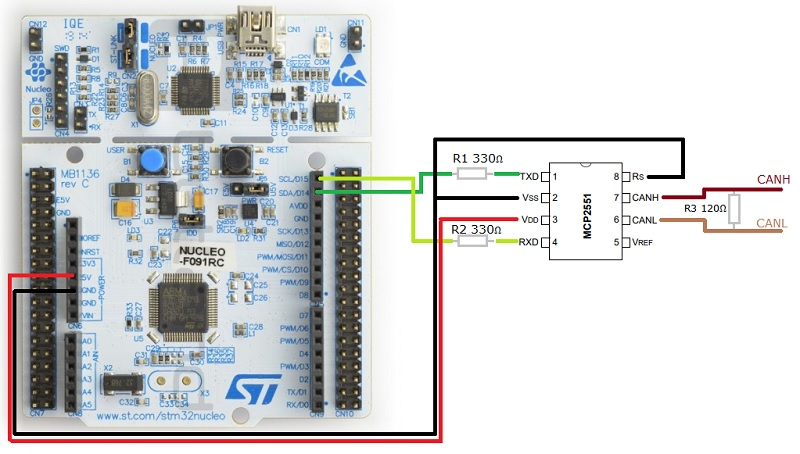

# CANopenNode example for Mbed OS

This guide reviews the steps required to get CANopenNode working on an Mbed OS platform.

**CANopenNode** is free and open source CANopen Stack.

CANopen is the internationally standardized (EN 50325-4)
([CiA301](http://can-cia.org/standardization/technical-documents))
CAN-based higher-layer protocol for embedded control system. For more
information on CANopen see http://www.can-cia.org/

CANopenNode is written in ANSI C in object-oriented way. It runs on
different microcontrollers, as standalone application or with RTOS.
Stack includes master functionalities. For Linux implementation with
CANopen master functionalities see
https://github.com/CANopenNode/CANopenSocket.

Variables (communication, device, custom) are ordered in CANopen Object
Dictionary and are accessible from both: C code and from CAN network.

CANopenNode homepage is https://github.com/CANopenNode/CANopenNode

## CANopen Features

 - NMT slave to start, stop, reset device. Simple NMT master.
 - Heartbeat producer/consumer error control.
 - PDO linking and dynamic mapping for fast exchange of process variables.
 - SDO expedited, segmented and block transfer for service access to all parameters.
 - SDO master.
 - Emergency message.
 - Sync producer/consumer.
 - Non-volatile storage.

## Usage of the CANopenNode

CANopenNode itself doesn't have complete working code for any microcontroller.
It is only the library with the stack and drivers for different
microcontrollers. It has example, which should compile on any system with
template driver (drvTemplate), which actually doesn't access CAN hardware.
CANopenNode should be used as a git submodule included in a project with

## Deploying the firmware

### Import the example application

Please install [mbed CLI](https://github.com/ARMmbed/mbed-cli#installing-mbed-cli).

From the command-line, import the example:

```
mbed import mbed-os-example-canopen
cd mbed-os-example-canopen
```

### Now compile

Invoke `mbed compile`, and specify the name of your platform and your favorite toolchain (`GCC_ARM`, `ARM`, `IAR`). For example, for the ARM Compiler 5:

```
mbed compile -m NUCLEO_F091RC -t GCC_ARM
```

Your PC may take a few minutes to compile your code. At the end, you see the following result:

```
[snip]
+-----------------------+--------------+----------+-----------+
| Module                |        .text |    .data |      .bss |
|-----------------------|--------------|----------|-----------|
| CANopenNode\CANopen.o |     3626(+0) |    0(+0) |    86(+0) |
| CANopenNode\stack     |  23056(-146) |    0(+0) |   276(+0) |
| CO_OD.o               |        0(+0) |  980(+0) |     0(+0) |
| [fill]                |       98(+2) |   12(+0) |    20(+0) |
| [lib]\c.a             |    25188(+0) | 2472(+0) |    89(+0) |
| [lib]\gcc.a           |     8464(+0) |    0(+0) |     0(+0) |
| [lib]\misc            |      192(+0) |    4(+0) |    28(+0) |
| main.o                |     1338(+0) |    0(+0) |   222(+0) |
| mbed-os\components    |      244(+0) |    0(+0) |     0(+0) |
| mbed-os\drivers       |     1804(+0) |    0(+0) |     0(+0) |
| mbed-os\events        |     3184(+0) |    0(+0) |  3108(+0) |
| mbed-os\hal           |     2970(+0) |    4(+0) |    66(+0) |
| mbed-os\platform      |     6008(+0) |  260(+0) |   364(+0) |
| mbed-os\rtos          |    18026(+0) |  168(+0) |  5973(+0) |
| mbed-os\targets       |    15318(+0) |    4(+0) |  1064(+0) |
| Subtotals             | 109516(-144) | 3904(+0) | 11296(+0) |
Total Static RAM memory (data + bss): 15200(+0) bytes
Total Flash memory (text + data): 113420(-144) bytes

Image: .\BUILD\NUCLEO_F091RC\GCC_ARM-DEBUG\mbed-os-example-canopen.bin
```

### Program your board

1. Connect your mbed device to the computer over USB.
2. Copy the binary file to the mbed device.
3. Press the reset button to start the program.

## Wiring



## Output

To view the serial output you can use any terminal client of your choosing such as [PuTTY](http://www.putty.org/) or [CoolTerm](http://freeware.the-meiers.org/).

The default baud rate for this application is set to `115200` and may be modified in the `mbed_app.json` file.

You can find more information on the Mbed OS configuration tools and serial communication in Mbed OS in the related [related links section](#related-links).


## Troubleshooting

If you have problems, you can review the [documentation](https://os.mbed.com/docs/latest/tutorials/debugging.html) for suggestions on what could be wrong and how to fix it.

## Related Links

* [Mbed OS Configuration](https://os.mbed.com/docs/latest/reference/configuration.html)
* [Mbed OS Serial Communication](https://os.mbed.com/docs/latest/tutorials/serial-communication.html)

### License and contributions

The software is provided under Apache-2.0 license. Contributions to this project are accepted under the same license. Please see contributing.md for more info.

This project contains code from other projects. The original license text is included in those source files. They must comply with our license guide.
